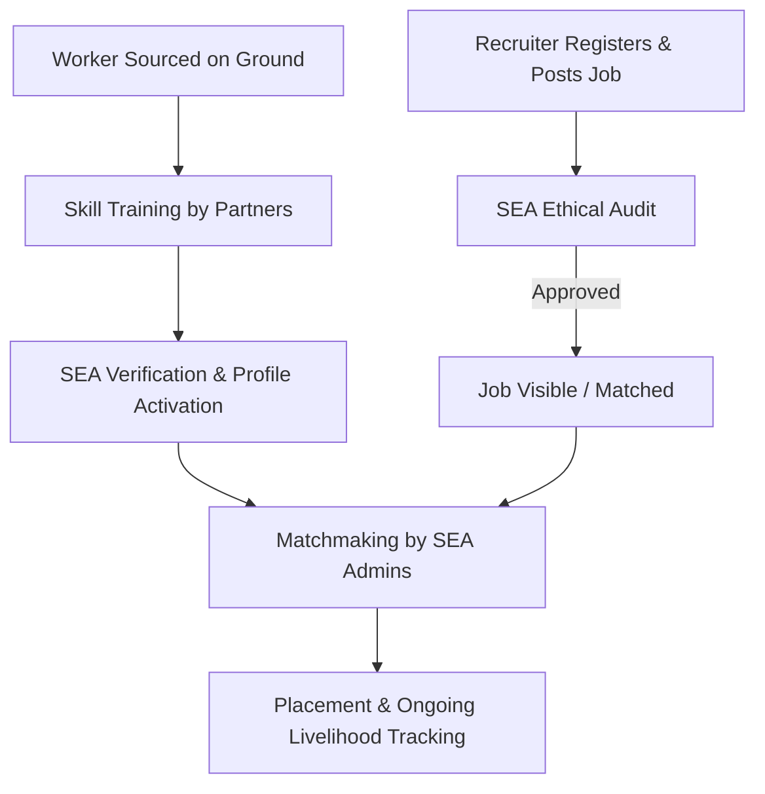

# Skill Grid Global — Project Concept & Requirements

Skill Grid Global is an initiative designed to bridge the livelihood gap for blue-collar and unorganized workers, particularly those displaced from rural agricultural sectors due to climate change, by matching them with ethical employers. SEA (Sustainable Ecology & Agriculture Movement) acts as the trusted mediator, ensuring workers are properly trained and verified, and that recruiters provide fair pay, legal compliance, and decent living facilities.

---

## 1. Core Mission & Objectives

*   **Livelihood Security**: Provide sustainable employment opportunities to rural and unorganized workers who face job losses in agriculture due to climate crises (e.g., rising temperatures, erratic monsoon patterns, and crop failures).
*   **Skill Standardization**: Partner with experienced training professionals (with 20–25 years in the skilling industry) to train workers for high-demand, low-end to mid-end jobs.
*   **Ethical Matchmaking**: Act as a protective buffer between vulnerable workers and recruiters, filtering out exploitative jobs and selecting employers based on values, fair compensation, and proper facilities.

---

## 2. Key Stakeholders & Roles

### A. The Candidates (Blue-Collar Workers)
*   **Who they are**: Unorganized, rural, or agricultural workers looking for consistent employment (e.g., mechanics, salon staff, hospitality workers, construction assistants, gig workers).
*   **Key Needs**: Safety, fair wages, clear job descriptions, housing support, legal protection, and a pathway to skill improvement.
*   **Tech Literacy**: Low to medium. Registration and job search interfaces must be highly intuitive, mobile-first, and potentially input-driven by SEA field agents.

### B. The Recruiters (Employers)
*   **Who they are**: Corporate employers, local business owners, or service providers seeking reliable, verified, and skilled labor.
*   **Key Needs**: Verified skills, reduced staff turnover, legal documentation verification, and direct communication.
*   **Key Obligation**: Must pass SEA's ethical screening (must offer fair wages, legal work terms, and appropriate living facilities).

### C. The Mediator (Sustainable Ecology & Agriculture Movement - SEA)
*   **Who they are**: SEA administrators, volunteers, and field agents.
*   **Key Functions**: 
    1.  Coordinate with skilling partners to train candidates.
    2.  Verify candidate identities and skill certifications on the ground.
    3.  Audit and approve recruiters based on ethical guidelines (e.g., rejecting low-paying, unsafe, or unsupported overseas placements).
    4.  Facilitate transparent placements.

---

## 3. Workflow & Lifecycle

### Step 1: Sourcing & Skilling
*   Field agents locate candidates in need of jobs.
*   Skilling partners train candidates in specialized vocations (soft and hard skills).
*   Completed training profiles are logged into the system.

### Step 2: Recruiter Vetting
*   Recruiters register and submit details about their organization, open positions, salaries, and offered benefits (housing, food, transport).
*   SEA admins conduct background checks to ensure values alignment. Unvetted or exploitative employers are rejected.

### Step 3: Matchmaking & Placement
*   SEA admins query the database for candidates who match the job's required skills, location, and salary requirements.
*   Admin coordinates the interview/onboarding process and officially marks the worker as "Placed".

---

## 4. Platform Requirements (Functional)

*   **Verified Worker Directory**: A secure, searchable database of trained workers, including their certification status, experience, and contact info (accessible primarily by admins and approved recruiters).
*   **Recruiter Portal**: A portal for recruiters to request workers, specify requirements (skills, count, salary, perks), and track matching statuses.
*   **Admin Control Panel**: A powerful interface for SEA admins to manage candidate profiles, review pending recruiter requests, match candidates to job listings, and record successful placements.
*   **Dual-language/Local Language Support**: Visual layout optimized for mobile screens with simple terminology to ensure ease of use for field representatives and workers.
