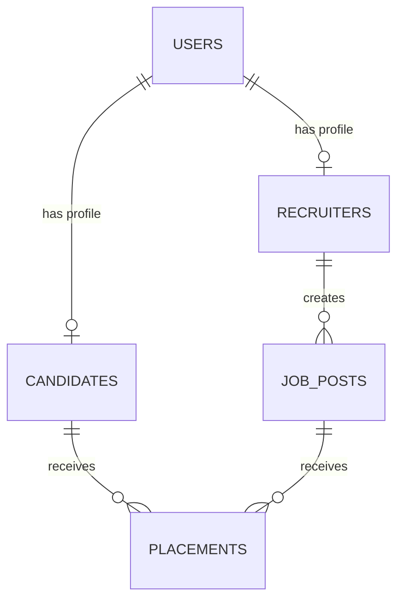

# Skill Grid Global — Technical Architecture & Implementation Plan

This document outlines the technical specification, software architecture, database schema, and phased implementation plan for the Skill Grid Global platform.

---

## 1. Recommended Tech Stack

To ensure fast prototyping, secure data storage, and easy maintenance for a fullstack developer, the following stack is recommended:

| Layer | Technology | Rationale |
| :--- | :--- | :--- |
| **Frontend** | **Vite + React (JS/TS)** | Fast setup, excellent performance, highly responsive for dashboards, and easy deployment. |
| **Styling** | **Modern Vanilla CSS / HSL CSS Variables** | Full design control to create a premium, clean aesthetic without Tailwind overhead (unless Tailwind is requested). |
| **Backend & DB**| **Supabase (PostgreSQL + Auth)** | Built-in authentication, direct PostgreSQL API access, instant database creation, and a ready-made admin panel for SEA. Saves weeks of custom API coding. |
| **Hosting** | **Vercel / Netlify** | Free-tier support, simple deployment of frontend code, automatic SSL, and global CDN distribution. |

---

## 2. Database Schema (PostgreSQL)

The system revolves around four key domains: users, candidates, recruiters, and jobs/placements.



### Table: `profiles`
Stores master login credentials and maps roles.
```sql
CREATE TYPE user_role AS ENUM ('candidate', 'recruiter', 'admin');

CREATE TABLE profiles (
    id UUID REFERENCES auth.users ON DELETE CASCADE PRIMARY KEY,
    name VARCHAR(255) NOT NULL,
    phone VARCHAR(20) UNIQUE,
    role user_role DEFAULT 'candidate' NOT NULL,
    created_at TIMESTAMP WITH TIME ZONE DEFAULT TIMEZONE('utc'::text, NOW()) NOT NULL
);
```

### Table: `candidates`
Stores skill details, location preference, and training statuses.
```sql
CREATE TYPE training_status_type AS ENUM ('registered', 'in_training', 'certified');

CREATE TABLE candidates (
    id UUID REFERENCES profiles(id) ON DELETE CASCADE PRIMARY KEY,
    skills TEXT[] DEFAULT '{}'::TEXT[],  -- e.g., {'carpenter', 'mechanic'}
    experience_years INT DEFAULT 0,
    current_location VARCHAR(100),
    preferred_location VARCHAR(100),
    training_status training_status_type DEFAULT 'registered',
    is_sea_verified BOOLEAN DEFAULT FALSE,
    vetted_by_admin UUID REFERENCES profiles(id),
    target_salary NUMERIC(10, 2),
    notes TEXT
);
```

### Table: `recruiters`
Stores corporate info and audit details for ethical verification.
```sql
CREATE TYPE vetting_status_type AS ENUM ('pending', 'approved', 'rejected');

CREATE TABLE recruiters (
    id UUID REFERENCES profiles(id) ON DELETE CASCADE PRIMARY KEY,
    company_name VARCHAR(255) NOT NULL,
    industry VARCHAR(100),
    location VARCHAR(100),
    ethical_score INT CHECK (ethical_score >= 1 AND ethical_score <= 5),
    vetting_status vetting_status_type DEFAULT 'pending',
    vetted_by_admin UUID REFERENCES profiles(id),
    website_url VARCHAR(255),
    csr_aligned BOOLEAN DEFAULT FALSE
);
```

### Table: `job_posts`
Contains job details, wages, and mandatory welfare criteria (housing, meals, etc.).
```sql
CREATE TYPE job_status_type AS ENUM ('open', 'filled', 'archived');

CREATE TABLE job_posts (
    id UUID DEFAULT gen_random_uuid() PRIMARY KEY,
    recruiter_id UUID REFERENCES recruiters(id) ON DELETE CASCADE NOT NULL,
    title VARCHAR(255) NOT NULL,
    description TEXT,
    skills_required TEXT[] DEFAULT '{}'::TEXT[],
    salary_offered NUMERIC(10, 2) NOT NULL,
    location VARCHAR(100) NOT NULL,
    provides_housing BOOLEAN DEFAULT FALSE,
    provides_meals BOOLEAN DEFAULT FALSE,
    provides_medical BOOLEAN DEFAULT FALSE,
    status job_status_type DEFAULT 'open',
    created_at TIMESTAMP WITH TIME ZONE DEFAULT TIMEZONE('utc'::text, NOW()) NOT NULL
);
```

### Table: `placements`
Tracks successful matches and records start dates.
```sql
CREATE TYPE placement_status_type AS ENUM ('matched', 'interviewing', 'placed', 'cancelled');

CREATE TABLE placements (
    id UUID DEFAULT gen_random_uuid() PRIMARY KEY,
    candidate_id UUID REFERENCES candidates(id) ON DELETE CASCADE NOT NULL,
    job_post_id UUID REFERENCES job_posts(id) ON DELETE CASCADE NOT NULL,
    matched_by UUID REFERENCES profiles(id),
    status placement_status_type DEFAULT 'matched',
    start_date DATE,
    created_at TIMESTAMP WITH TIME ZONE DEFAULT TIMEZONE('utc'::text, NOW()) NOT NULL
);
```

---

## 3. Core Modules & User Flows

### A. Candidate Registration Flow (Field-Agent Assisted)
1.  **Field Sourcing**: A SEA representative meets a candidate on the ground.
2.  **Data Input**: The agent logs into the mobile-responsive web app under their admin/volunteer account.
3.  **Profile Creation**: The agent fills in the worker's name, phone, skills, and assigns their current training status.

### B. Recruiter Registration & Vetting Flow
1.  **Sign-up**: Recruiter registers company and fills in an "Ethical Practices Checklist" (e.g., standard wages, work hours, safety gear, facilities).
2.  **Pending Status**: Profile is locked in "Pending" status. Recruiter cannot view candidate directories yet.
3.  **Vetting**: SEA admin receives a notification, reviews the details, calls or visits if needed, and toggles the recruiter's status to **Approved**.

### C. Admin Matchmaking Flow
1.  **Job Posting**: Vetted recruiter posts a new opening for *5 bike mechanics, salary ₹25,000, food and housing provided*.
2.  **Automated Filtering**: The platform matches candidates who have the tag `'mechanic'`, are `'certified'`, and are willing to work in that location.
3.  **Direct Assignment**: The SEA admin reviews the matches, talks to the candidates, and links their profiles to the job post, moving their placement status to `interviewing` or `placed`.

---

## 4. UI/UX Design System Guidelines

To make the platform feel premium and highly usable:
*   **Color Palette**: Sleek dark mode or clean nature-toned light mode (e.g., Forest Green, Charcoal Black, Warm Off-White, Steel Gray) rather than standard primary colors.
*   **Micro-interactions**: Smooth transitions on dashboard tabs, hover scaling for card grids, and clear badges indicating verification (`SEA Verified` in gold/green).
*   **Accessibility**: High text contrast, large form input fields, and mobile responsiveness for data collection on the ground.

---

## 5. Phased Implementation Strategy

```
Phase 1: DB & Admin Panel ➔ Phase 2: Recruiter Portal ➔ Phase 3: Matching & Placements ➔ Phase 4: Mobile-First Agent App
```

*   **Phase 1: Database Setup & Core Admin Panel (Week 1–2)**
    *   Set up Supabase project and run the SQL schema scripts.
    *   Build a simple React-based Admin Dashboard for SEA to input and manage candidates.
*   **Phase 2: Recruiter Portal & Job Postings (Week 2–3)**
    *   Implement auth pages for recruiters.
    *   Build the recruiter registration flow and the "Ethical Practice Checklist" form.
    *   Implement job posting dashboard.
*   **Phase 3: Vetting & Matchmaking Engine (Week 3–4)**
    *   Create the admin interface to approve/vet recruiters.
    *   Develop the query filters to match certified candidates with active jobs.
    *   Create placement tracking state.
*   **Phase 4: Field Agent Experience & Launch (Week 4+)**
    *   Optimize the UI for mobile screens so volunteers can register workers on the go.
    *   Set up production builds and host the web application.
